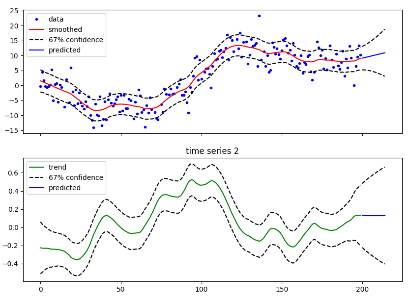

simdkalman documentation
======================================

.. include:: DESCRIPTION.rst

**Installation**: ``pip install simdkalman``

**Source code**:  https://github.com/oseiskar/simdkalman

**License**: `MIT <https://github.com/oseiskar/simdkalman/blob/master/LICENSE.txt>`_

Terminology
------------

.. automodule:: simdkalman

For a complete code example with figures, see:
https://github.com/oseiskar/simdkalman/blob/master/examples/example.py

Class documentation
-------------------

.. autoclass:: simdkalman.KalmanFilter
   :members:

Change log
-----------

See https://github.com/oseiskar/simdkalman/releases
